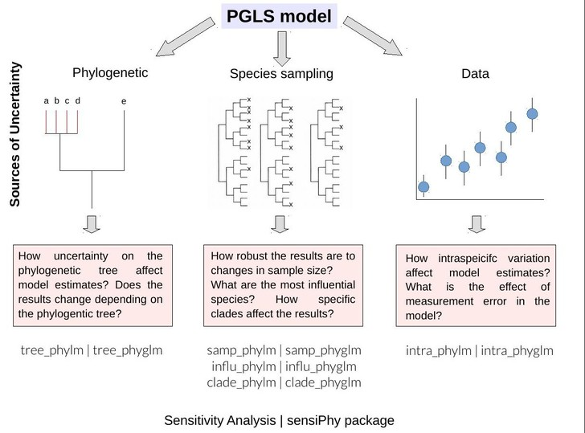

Conclusions drawn from phylogenetic comparative methods can be sensitive to uncertainty in data, phylogenetic, sampling design.
The robustness of (key) conclusions to these various forms of uncertainty must be addressed and quantified in order to be confident about the biological conclusions. 
We present SensiPhy, an R-package to easily and rapidly perform sensitivity analysis in phylogenetic regression models, both for linear and logistic phylogenetic regression. 
SensiPhy allows researchers to assess species uncertainty, detect influential species and clades, quantify sampling effort and evaluate effects of intraspecific variation and phylogenetic uncertainty. 
By providing a single, one-stop, package that takes into account various sources of uncertainty, SensiPhy allows for phylogenetic sensitivity analysis in a quick and user-firendly way. 
Using real datasets we show how conclusions from phylogenetic comparative methods can be affected by uncertainty and how SensiPhy can help determine if a conclusion is robust. 


## Types of uncertainty

The R package `sensiPhy` can estimate the impact of different types of uncertainty 
for PGLS models. Each type of uncertainty has different functions for simple
linear regressions and logist regressions (Fig. 1).



## Styles

The `html_vignette` template includes a basic CSS theme. To override this theme you can specify your own CSS in the document metadata as follows:

    output: 
      rmarkdown::html_vignette:
        css: mystyles.css

## Figures

The figure sizes have been customised so that you can easily put two images side-by-side. 

```{r, fig.show='hold'}
plot(1:10)
plot(10:1)
```

You can enable figure captions by `fig_caption: yes` in YAML:

    output:
      rmarkdown::html_vignette:
        fig_caption: yes

Then you can use the chunk option `fig.cap = "Your figure caption."` in **knitr**.

## More Examples

You can write math expressions, e.g. $Y = X\beta + \epsilon$, footnotes^[A footnote here.], and tables, e.g. using `knitr::kable()`.

```{r, echo=FALSE, results='asis'}
knitr::kable(head(mtcars, 10))
```

Also a quote using `>`:

> "He who gives up [code] safety for [code] speed deserves neither."
([via](https://twitter.com/hadleywickham/status/504368538874703872))
