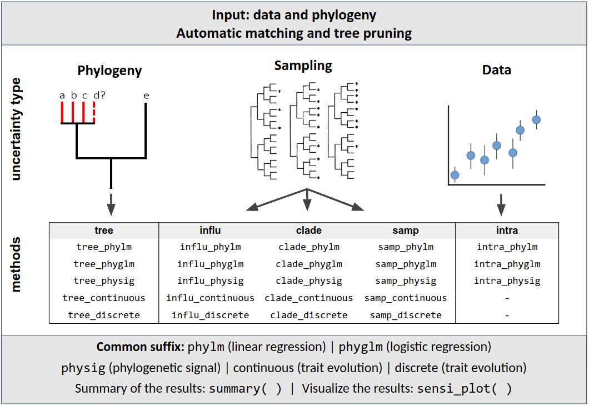

##**Introduction to sensiPhy**
The **sensiPhy** package provides simple functions to perform sensitivity analyses in phylogenetic comparative methods. It uses several simulation methods to estimate the impact of different types of uncertainty on Phylogenetic comparative methods:

(i) Species Sampling uncertainty (sample size; influential species and clades)
(ii) Phylogenetic uncertainty
(iii) Data uncertainty (intraspecific variation and measurement error)

**Functions for sensitivity analysis**

sensiPhy functions use a common syntax that combines the type of uncertainty and the type of analysis:

- xxx_**phylm** (for linear regressions)
- xxx_**phyglm** (for logistic regressions)
- xxx_**physig** (for phylogenetic signal)
* xxx_**continuous** (for continuous trait evolution)
* xxx_**discrete** (for discrete trait evolution)

where "xxx" can be one of the 5 sensiPhy methods (see Figure below):

- **Species sampling uncertainty**: influ; clade; samp;
- **Phylogenetic uncertainty**: tree
- **Data uncertainty**: intra

**sensiPhy** workflow & functions


```{r, out.width = "700px", echo=FALSE}

```

**Additional functions**

* **match_dataPhy**:  Match data and phylogeny based on model formula
* **miss.phylo.d**: Calculate the phylogenetic signal for missing data
* **tree.bd**: Tree diversification and speciation with phylogenetic uncertainty


## 1. Sampling uncertainty

### 1.1 Sensitivity analysis for influential species

The `influ` method performs leave-one-out deletion analyis and detects influential species on parameter estimates.

##### 1.1.1 influ_phylm(): Phylogenetic linear regression

```{r echo=TRUE, warning=FALSE, message=FALSE}
library(sensiPhy)
# run analysis:
influ <- influ_phylm(log(gestaLen) ~ log(adultMass), phy = alien$phy[[1]], 
                     data = alien$data, track=FALSE)
```
Note that `track = TRUE` shows the progress of the analysis

```{r echo=TRUE, warning=FALSE, message=FALSE, fig.width=7.5, fig.height=6}
# To check summary results:
summary(influ)

# Most influential species
influ$influential.species

# Visual diagnostics
sensi_plot(influ)
```
```{r echo=TRUE, warning=FALSE, message=FALSE, fig.width=6, fig.height=5.5}
# Check most influential species on the original regression plot:
sensi_plot(influ, graphs = 2)
```

##### 1.1.2. influ_physig(): Phylogenetic signal

```{r echo=TRUE, warning=FALSE, message=FALSE, fig.width=6.5, fig.height=4} 
# Logtransform data
alien.data$logMass <- log(alien.data$adultMass)
# Run sensitivity analysis:
influ <- influ_physig("logMass", data = alien.data, phy = alien.phy[[1]], track=FALSE)
# You can change the method used to estimate signal:
influ2 <- influ_physig("logMass", data = alien.data, phy = alien.phy[[1]], method = "lambda", track=FALSE)

# To check summary results:
summary(influ)
# Most influential speciesL
influ$influential.species
# Visual diagnostics
sensi_plot(influ)
sensi_plot(influ2)
```
```{r echo=TRUE, warning=FALSE, message=FALSE, fig.width=4.5, fig.height=4} 
# You can specify which graph to print:
sensi_plot(influ, graphs = 1)
sensi_plot(influ2, graphs = 1)
```

##### 1.1.3 influ_continuous() and influ_discrete: Trait Evolution Continous and Discrete Characters

**Continuous characters**
```{r echo=TRUE, warning=FALSE, message=FALSE, fig.width=7.5, fig.height=5.5} 
# Load data:
data("primates")
# Model trait evolution accounting for influential species
adultMass<-primates$data$adultMass
names(adultMass)<-rownames(primates$data)
# Model trait evolution accounting for influential species
influ_cont<-influ_continuous(data = adultMass,phy = primates$phy[[1]],
model = "OU",cutoff = 2,n.cores = 2,track = FALSE)
# Print summary statistics for the transitions rates, aic-values and (if applicable) 
# optimisation parameter
summary(influ_cont)
# Visual diagnostics
sensi_plot(influ_cont)
```

Different evolutionary models from `fitContinuous` can be used: `BM`,`OU`,
`EB`, `trend`, `lambda`, `kappa`, `delta` and `drift`.

**Discrete characters**
```{r echo=TRUE, warning=FALSE, message=FALSE, fig.width=7.5, fig.height=5.5} 
# Load data:
data("primates")

# Create a binary trait factor 
adultMass_binary<-ifelse(primates$data$adultMass > 7350, "big", "small")
adultMass_binary<-as.factor(as.factor(adultMass_binary))
names(adultMass_binary)<-rownames(primates$data)

# Model trait evolution accounting for influential species - symmetric model
influ_binary <- influ_discrete(data = adultMass_binary, phy = primates$phy[[1]],
model = "SYM", transform = "none", cutoff = 2, n.cores = 2, track = FALSE)

# Print summary statistics for the transition rates, aic-values and 
# (if applicable) optimisation parameter
summary(influ_binary)

# Visual diagnostics - in symmetrical model q12 and q21 are, as expected, 
# exactly the same 
sensi_plot(influ_binary)
```

Different character models from `fitDiscrete` can be fit by changing the `model` argument.
These include `ER` (equal-rates), `SYM` (symmetric), `ARD` (all-rates-different) 
and `meristic` (stepwise fashion). Similarly, all transformations to the phylogenetic tree 
from `fitDiscrete` can be used: `none`, `EB`, `lambda`, `kappa` and `delta`.


### 1.2. Sensitivity analysis for influential clades

The `clade` method can be used to estimate and test the influence of specific clades on parameter estimates.

##### 1.2.1 clade_phylm(): Phylogenetic linear regression
Additional arguments:
**clade.col**: The name of a column in the provided data frame with clades specification (a character vector with clade names).
**n.species**: Minimum number of species in the clade in order to include this clade in the leave-one-out deletion analysis. Default is 5.
**n.sim**: The number of repetitions for the randomization test

```{r warning=FALSE, message=FALSE, fig.width=7.5, fig.height=5} 
data(primates)
# run analysis:
clade <- clade_phylm(log(sexMaturity) ~ log(adultMass), phy = primates$phy[[1]],
                     data = primates$data, clade.col = "family", track=FALSE)
# To check summary results and most influential clades:
summary(clade)
```


```{r echo=TRUE, warning=FALSE, message=FALSE, fig.width=8, fig.height=5.5} 
# Visual diagnostics for clade removal:
sensi_plot(clade, "Cercopithecidae")
```

```
sensi_plot(clade, "Cebidae")
```

##### 1.2.2 clade_physig(): Phylogenetic signal
```{r echo=TRUE, warning=FALSE, message=FALSE, fig.width=6, fig.height=5} 
# Logtransform data
alien.data$logMass <- log(alien.data$adultMass)
# Run sensitivity analysis:
clade <- clade_physig(trait.col = "logMass", data = alien.data, n.sim = 100,
                      phy = alien.phy[[1]], clade.col = "family", method = "K", track=FALSE)
summary(clade)
sensi_plot(clade, "Bovidae")
sensi_plot(clade, "Sciuridae")
```


##### 1.2.3 clade_continuous() and clade_discrete: Trait Evolution Continous and Discrete Characters

**Continuous characters**
```{r echo=TRUE, warning=FALSE, message=FALSE, fig.width=7.5, fig.height=5.5}
# Load data:
data("primates")
# Model trait evolution accounting for influential clades
clade_cont <- clade_continuous(data=primates$data, phy = primates$phy[[1]], 
model="OU", trait.col = "adultMass", clade.col="family", n.sim=30, n.species=10, 
n.cores = 2, track=TRUE)

# Check summary statistics for the transitions rates, aic-values and (if applicable) optimisation parameter
summary(clade_cont)
# Visual diagnostics
sensi_plot(clade_cont,graph="all")
# Plot only one clade and one parameter
sensi_plot(clade_cont,clade="Cebidae",graph = "optpar")
```

**Discrete characters**
```{r echo=TRUE, warning=FALSE, message=FALSE, fig.width=7.5, fig.height=5.5}
# Load data:
data("primates")

# Create a binary trait factor 
primates$data$adultMass_binary<-ifelse(primates$data$adultMass > 7350, "big", "small")
# Model trait evolution accounting for influential clades
clade_disc <- clade_discrete(data=primates$data,phy = primates$phy[[1]],
                             model="ARD",transform="kappa",
                             trait.col = "adultMass_binary", clade.col = "family",
                             n.sim = 30, n.species=8,n.cores = 2)
# Check summary statistics:
summary(clade_disc)
# Visual diagnostics
sensi_plot(clade_disc)
```


### 1.3. Sensitivity analysis for sample size

The `samp` method performs analyses of sensitivity to species sampling by 
randomly removing species from the dataset and detecting the effects on parameter estimates.

### 1.3.1 samp_phylm: Phylogenetic Linear regression

* Additional arguments:   
__breaks:__ A vector containing the percentages of species to remove  
__n.sim:__ The number of times species are randomly deleted for each break  

``` {r warning=FALSE, message=FALSE, fig.width=7.5, fig.height=6}
# run analysis:
samp <- samp_phylm(log(gestaLen) ~ log(adultMass), phy = alien$phy[[1]], 
                   data = alien$data, n.sim = 50, track=FALSE)

# You can change the number of repetitions and break intervals:
samp2 <- samp_phylm(log(gestaLen) ~ log(adultMass), phy = alien$phy[[1]],
                    data = alien$data, n.sim = 100, breaks = c(0.1, 0.2, 0.3, 0.4), track=FALSE)
# You can change the phylogenetic model:
samp3 <- samp_phylm(log(gestaLen) ~ log(adultMass), phy = alien$phy[[1]], 
                   data = alien$data, model = "kappa", track=FALSE)
# Check results:
summary(samp)
```
``` {r eval=FALSE}
# Visual diagnostics
sensi_plot(samp)
sensi_plot(samp2)
sensi_plot(samp3)

# You can specify which graph and parameter ("slope" or "intercept") to print: 
sensi_plot(samp2, graphs = 1)
sensi_plot(samp2, param = "intercept")
sensi_plot(samp2, graphs = 2, param = "estimate")
sensi_plot(samp)
sensi_plot(samp2, graphs = 1)
```
``` {r warning=FALSE, message=FALSE, fig.width=7.5, fig.height=7}
sensi_plot(samp)
```

### 1.3.2 samp_physig: Phylogenetic signal (k or lambda)

* Additional arguments:   
  __trait.col:__ The name of a column in the provided data frame with trait to
be analyzed (e.g. "Body_mass").  
  __method:__ Method to compute phylogenetic signal: can be "K" or "lambda".

``` {r warning=FALSE, message=FALSE, fig.width=7.5, fig.height=7}
# Logtransform data
alien.data$logMass <- log(alien.data$adultMass) 

# Run sensitivity analysis:
samp <- samp_physig(trait.col = "logMass", data = alien.data, n.sim = 30, phy = alien.phy[[1]], track=FALSE)
# You can change the method used to estimate signal:
samp2 <- samp_physig(trait.col = "logMass", data = alien.data, n.sim = 30,
                    phy = alien.phy[[1]], method = "lambda", track=FALSE)
# Check results:
summary(samp)
# Visual diagnostics
sensi_plot(samp)
```
``` {r eval=FALSE}
# More visual diagnostics
sensi_plot(samp2)
sensi_plot(samp, graphs = 1)
```


### 1.3.3 samp_continuous() and samp_discrete: Trait Evolution Continous and Discrete Characters

**Continuous characters**
``` {r warning=FALSE, message=FALSE, fig.width=7.5, fig.height=4}
# Load data:
data("primates")

# Model trait evolution
adultMass<-primates$data$adultMass
names(adultMass)<-rownames(primates$data)
samp_cont<-samp_continuous(data = adultMass,phy = primates$phy[[1]],
model = "OU",n.sim=25,breaks=seq(.05,.2,.05),n.cores = 2, track = FALSE)
# Print summary statistics for the transitions rates, aic-values and (if applicable) 
# optimisation parameter
summary(samp_cont)
# Visual diagnostics
sensi_plot(samp_cont)
```

**Discrete characters**
``` {r warning=FALSE, message=FALSE, fig.width=8, fig.height=7}
# Load data:
data("primates")
# Create a binary trait factor 
adultMass_binary<-ifelse(primates$data$adultMass > 7350, "big", "small")
adultMass_binary<-as.factor(as.factor(adultMass_binary))
names(adultMass_binary)<-rownames(primates$data)
# Model trait evolution
samp_binary <- samp_discrete(data = adultMass_binary,phy = primates$phy[[1]], n.sim=25,
    breaks = seq(.1,.3,.1),model = "ARD", transform = "lambda", n.cores = 2,
    track = TRUE)
# Print summary statistics for the transitions rates, aic-values and (if applicable) 
# optimisation parameter
summary(samp_binary)
# Visual diagnostics
sensi_plot(samp_binary)
```


## 2. Phylogenetic uncertainty
The `tree` method performs sensitivity analysis to estimate the influence of 
phylogenetic uncertainty on parameter estimates.

Additional arguments:   
__n.tree:__ Number of times to repeat the analysis with n different trees picked
randomly in the multiPhylo file.

### 2.1 tree_phylm: `tree` method for phylogenetic linear regression
``` {r warning=FALSE, message=FALSE, fig.width=7.5, fig.height=6}
# Load data
data(alien)
# This analysis needs a multiphylo file:
class(alien$phy)
alien$phy
# run PGLS accounting for phylogenetic uncertainty:
tree <- tree_phylm(log(gestaLen) ~ log(adultMass), phy = alien$phy, 
                   data = alien$data, n.tree = 30, track=FALSE)
# To check summary results:
summary(tree)
# Visual diagnostics
sensi_plot(tree)
```


### 2.2 tree_physig(): `tree` method for phylogenetic signal

``` {r warning=FALSE, message=FALSE, fig.width=7.5, fig.height=4}
# Load data:
data(alien)
# Logtransform data
alien.data$logMass <- log(alien.data$adultMass) 
# Run sensitivity analysis:
tree <- tree_physig(trait.col = "logMass", data = alien.data, phy = alien.phy, track=FALSE)
summary(tree)
```
``` {r eval=FALSE}
sensi_plot(tree, graphs = 1)
sensi_plot(tree, graphs = 2)
```
``` {r warning=FALSE, message=FALSE, fig.width=6, fig.height=4}
sensi_plot(tree) 
```


### 2.3 tree_continuous() and tree_discrete: `tree` method for trait evolution of continous and discrete characters

**Continuous characters**
``` {r warning=FALSE, message=FALSE, fig.width=7.5, fig.height=6}
# Load data:
data("primates")
# Model trait evolution accounting for phylogenetic uncertainty
adultMass<-primates$data$adultMass
names(adultMass)<-rownames(primates$data)
tree_cont<-tree_continuous(data = adultMass,phy = primates$phy,
model = "OU",n.tree=30,n.cores = 2,track = FALSE)
# Print summary statistics for the transitions rates, aic-values and (if applicable) 
# optimisation parameter
summary(tree_cont)
``` {r eval=FALSE}
# Plot only some parameters
sensi_plot(tree_cont,graphs="sigsq")
sensi_plot(tree_cont,graphs="optpar")
```
``` {r warning=FALSE, message=FALSE, fig.width=7.5, fig.height=6}
## Visual diagnostics
sensi_plot(tree_cont)
```

**Discrete characters**
``` {r warning=FALSE, message=FALSE, fig.width=7.5, fig.height=6}
# Load data:
data("primates")
# Create a binary trait factor 
adultMass_binary<-ifelse(primates$data$adultMass > 7350, "big", "small")
adultMass_binary<-as.factor(as.factor(adultMass_binary))
names(adultMass_binary)<-rownames(primates$data)
# Model trait evolution accounting for phylogenetic uncertainty
tree_binary<-tree_discrete(data = adultMass_binary,phy = primates$phy,
model = "ARD",transform = "none",n.tree = 30,n.cores = 2,track = FALSE)
# Print summary statistics for the transitions rates, aic-values and (if applicable) 
# optimisation parameter
summary(tree_binary)
``` {r eval=FALSE}
## Visual diagnostics
sensi_plot(tree_binary,graphs="q12")
sensi_plot(tree_binary,graphs="q21")
```
``` {r warning=FALSE, message=FALSE, fig.width=7.5, fig.height=6}
sensi_plot(tree_binary)
```


## 3. Data uncertainty
The `intra` method performs Sensitivity analysis for intraspecific variation and measurement error

### 3.1 intra_phylm(): `intra` method for phylogenetic linear regression

Additional arguments:   
 __Vy:__ Name of the column containing the standard deviation or the standard 
error of the response variable. When information is not available for one taxon,
the value can be 0 or NA.  
 __Vx:__ Name of the column containing the standard deviation or the standard 
error of the predictor variable. When information is not available for one taxon,
the value can be 0 or NA  
 __x.transf:__ Transformation for the response variable (e.g. log or sqrt). Please 
use this argument instead of transforming data in the formula directly.  
 __y.transf:__ Transformation for the predictor variable (e.g. log or sqrt). Please 
use this argument instead of transforming data in the formula directly.  
 __distrib:__ A character string indicating which distribution to use to generate
a random value for the response and/or predictor variables. Default is normal
distribution: "normal" (function rnorm). Uniform distribution: "uniform" (runif)
Warning: we recommend to use normal distribution with Vx or Vy = standard 
deviation of the mean.      
 __n.intra:__ Number of times to repeat the analysis with n different trees picked
randomly in the multiPhylo file. If NULL, times = 2   

``` {r warning=FALSE, message=FALSE, fig.width=6, fig.height=5}
# run PGLS accounting for intraspecific variation:
intra <- intra_phylm(gestaLen ~ adultMass, phy = alien$phy[[1]], 
                     data = alien$data, Vy = "SD_gesta", Vx = "SD_mass",
                     n.intra = 100, x.transf = log, y.transf = log, track=FALSE)
# To check summary results:
summary(intra)
# Visual diagnostics
sensi_plot(intra)
```


### 3.2 intra_physig(): `intra` method for phylogenetic signal

Additional arguments:   
  __V__: Name of the column containing the standard deviation or the standard 
error of the trait variable. When information is not available for one taxon,
the value can be 0 or NA. 

``` {r warning=FALSE, message=FALSE, fig.width=7.5, fig.height=6}
data(alien)
# Run sensitivity analysis:
intra <- intra_physig(trait.col = "gestaLen", V = "SD_gesta" , data = alien.data, 
                      phy = alien.phy[[1]], n.intra = 100, track=FALSE)
summary(intra)
```
``` {r eval=FALSE}
sensi_plot(intra, graphs = 1)
sensi_plot(intra, graphs = 2)
```
``` {r warning=FALSE, message=FALSE, fig.width=6, fig.height=4}
sensi_plot(intra)
```


## 4. Interacting uncertainties

The 'sensiPhy' package can perform sensitivity analysis by interacting multiple types of uncertainty (described above). 

'sensiPhy' implements functions to study interactions of both phylogenetic uncertainty (tree-functions) and data uncertainty (intra-functions) with sampling uncertainty (`clade`, `influ`, and `samp`), as well as interactions between data and phylogenetic uncertainty (`tree_intra`).

Both `intra` and `tree` methods can be used together with all other uncertainties to evaluate the interaction between two types of uncertainty at the same time. 

### Examples:  
#### 4.1 tree_influ_phylm(): `tree_influ` method for phylogenetic linear regression

``` {r warning=FALSE, message=FALSE, fig.width=7.5, fig.height=6}
data(alien)
# run analysis:
tree_influ <- tree_influ_phylm(log(gestaLen) ~ log(adultMass), phy = alien$phy, 
                               data = alien$data, n.tree = 5, track=FALSE)
# To check summary results:
summary(tree_influ)
```
``` {r eval=FALSE}
# Visual diagnostics
sensi_plot(tree_influ, graphs = 1)
sensi_plot(tree_influ, graphs = 2)
```
``` {r warning=FALSE, message=FALSE, fig.width=7.5, fig.height=6}
sensi_plot(tree_influ)
```


#### 4.2 tree_clade_phylm(): `tree_clade` method for phylogenetic linear regression

``` {r warning=FALSE, message=FALSE, fig.width=7, fig.height=4}
data(primates)
# run analysis:
clade_tree <- tree_clade_phylm(log(sexMaturity) ~ log(adultMass), 
                               phy = primates$phy, data = primates$data,
                               clade.col = "family",
                               n.sim = 50, n.tree = 5, track=F)
# To check summary results and most influential clades:
summary(clade_tree)
```
``` {r warning=FALSE, message=FALSE, fig.width=7.5, fig.height=5}
# Visual diagnostics for clade removal:
sensi_plot(clade_tree)
```
``` {r eval=FALSE}
# Specify which clade removal to plot:
sensi_plot(clade_tree, "Cercopithecidae")
sensi_plot(clade_tree, clade = "Cebidae")
```


#### 4.3 tree_samp_phylm(): `tree_samp` method for phylogenetic linear regression

``` {r warning=FALSE, message=FALSE, fig.width=6, fig.height=4}
# Load data:
data(alien)
# Run analysis:
samp <- tree_samp_phylm(log(gestaLen) ~ log(adultMass), phy = alien$phy,
                        data = alien$data, n.tree = 5, n.sim=30, track=FALSE)
summary(samp)
head(samp$sensi.estimates)
# Visual diagnostics
sensi_plot(samp)
```
``` {r eval=FALSE}
sensi_plot(samp, graphs = 1)
sensi_plot(samp, graphs = 2)
```


#### 4.4 tree_intra_phylm(): `tree_intra` method for phylogenetic linear regression

``` {r warning=FALSE, message=FALSE, fig.width=7.5, fig.height=6}
# Load data:
data(alien)
# run PGLS accounting for intraspecific and phylogenetic variation:
intra.tree <- tree_intra_phylm(gestaLen ~ adultMass, data = alien$data, phy = alien$phy,
                               Vy = "SD_gesta", n.intra = 10, n.tree = 30, 
                               y.transf = log, x.transf = log, track=FALSE)
# To check summary results:
summary(intra.tree)
# Visual diagnostics
sensi_plot(intra.tree, uncer.type = "all") #or uncer.type = "tree", uncer.type = "intra"
```

## 5. Additional functions

### 5.1 Combine data and phylogeny

The funcion `match_dataphy` combines phylogeny and data to ensure that tips in phylogeny match data
and that observations with missing values are removed.

> This function uses all variables provided in the 'formula' to match data and phylogeny. To avoid cropping the full dataset, 'match_dataphy' searches for NA values only on variables provided by formula. Missing values on other variables, not included in 'formula', will not be removed from data.

``` {r warning=FALSE, message=FALSE}
library(sensiPhy)
# Load data:
data(alien)
# Match data and phy based on model formula:
comp.data <- match_dataphy(gestaLen ~ homeRange, data = alien$data, alien$phy[[1]], track=FALSE)
# With a `multiphylo` tree:
comp.data2 <- match_dataphy(homeRange ~ homeRange, data = alien$data, alien$phy, track=FALSE)
# Check combined data:
knitr::kable(head(comp.data$data))
```

``` {r warning=FALSE, message=FALSE, fig.width=7.5, fig.height=6}
# Check phy:
plot(comp.data$phy)
```

``` {r warning=FALSE, message=FALSE, fig.width=7.5, fig.height=6}
# See species dropped from phy or data:
comp.data$dropped
```

### 5.2 Phylogenetic signal for missing data
#### Background
The supplementary function `miss.phylo.d` tests if there is a phylogenetic signal in missing data, using the D framework developed in Fritz & Purvis (2010). A phylogenetic signal in missing data can bias comparative analyses, because it means that absence of data points is not independent of the phylogeny. This function can help alert users to this problem, suggesting that more balanced data collection would be required.

The function calculates D statistic for missing data.
Missingness is recoded into a binary variable (1 = missing, 0 = non missing). 

#### Example:
``` {r warning=FALSE, message=FALSE, fig.width=7.5, fig.height=6}
library(sensiPhy)
# Load caper:
library(caper)
# Load data
data(alien)
knitr::kable(head(alien.data))
```

``` {r warning=FALSE, message=FALSE, fig.width=5, fig.height=4}
data <- alien.data
phy = alien.phy[[1]]

# Test phylogenetic signal for missing data:
homeNAsig <- miss.phylo.d(data, phy, binvar = homeRange)
print(homeNAsig)
plot(homeNAsig)
```

``` {r warning=FALSE, message=FALSE, fig.width=5, fig.height=4}
massNAsig <- miss.phylo.d(data, phy, binvar = adultMass)
print(massNAsig)
plot(massNAsig)
```

### 5.3 Diversification and speciation rates
#### Background
The funcion `tree_bd`estimates diversification and speciation rates evaluating uncertainty in tree topology.
It estimates net diversification rate using `geiger::bd.ms` Magallon and Sanderson (2000) method
or speciation rate using `geiger::bd.km` Kendall-Moran method for `n` trees, randomly picked from a `multiPhylo` file.

#### Examples:
*To estimate diversification rate with Magallon and Sanderson method*
``` {r warning=FALSE, message=FALSE, fig.width=8, fig.height=4}
library(sensiPhy)
# Load data:
data("primates")
# Run analysis
fit.ms <- tree_bd(phy = primates.phy, n.tree = 30, method = "ms")
# Check results
summary(fit.ms)
# Plot data
sensi_plot(fit.ms)
```


*To estimate speciation rate Kendall-Moran method*
``` {r warning=FALSE, message=FALSE, fig.width=8, fig.height=4}
# Load data:
data("primates")
# Run analysis
fit.km <- tree_bd(phy = primates.phy, n.tree = 30, method = "km")
# Check results
summary(fit.km)
# Plot data
sensi_plot(fit.km)
```


## 6. How to support sensiPhy
Thanks for you interest in contributing with `sensiPhy`. First you need to register at [Github](https://github.com/). You can help developing `sensiPhy` in different ways:

### 6.1 Report bugs or errors

If you have any problem running `sensiPhy` functions, please report the problem as a new [issue](https://github.com/paternogbc/sensiPhy/issues/new). To do this, folow the steps below:

 * Create a new [issue](https://github.com/paternogbc/sensiPhy/issues/new)
 * Name this issue as "BUG: function_name
 * Write a small description about your problem/error
 * If possible, include a reproducible example using the R package [reprex](https://github.com/tidyverse/reprex/blob/master/README.md)

### 6.2 Small changes in `sensiPhy` documentation

If you find a typo on `sensiPhy` documentation or if you want to make a small change on any file, you can do it online. Search for the file you want to change at the [master branch](https://github.com/paternogbc/sensiPhy), then:

 * Edit the file online
 * Save your change
 * Describe the changes you have made
 * Click `send a pull request`

### 6.3 Contribute with code

If you want to make a bigger contribution and help us with `sensiPhy` code:

1. Fork it (https://github.com/paternogbc/sensiPhy/fork)
2. Create your feature branch (`git checkout -b my-new-feature`)
3. Commit your changes (`git commit -am 'Add some feature'`)
4. Push to the branch (`git push origin my-new-feature`)
5. Create a new Pull Request

### 6.4 New ideas or suggestions? 

If you need to ask something via email, send to [paternogbc@gmail.com](mailto:paternogbc@gmail.com)

### 6.5 Code of Conduct
Please note that this project is released with a Contributor Code of Conduct. By participating in this project you agree to abide by its [terms](https://github.com/paternogbc/sensiPhy/blob/master/CODE_OF_CONDUCT.md).

## 7. How to cite sensiPhy
To cite package ‘sensiPhy’ in publications use:

  Gustavo Paterno, Gijsbert Werner and Caterina Penone (2016). sensiPhy: Sensitivity Analysis for
  Comparative Methods. R package version 0.6.0. https://github.com/paternogbc/sensiPhy

A BibTeX entry for LaTeX users is

  @Manual{,  
    title = {sensiPhy: Sensitivity Analysis for Comparative Methods},  
    author = {Gustavo Paterno and Gijsbert Werner and Caterina Penone},  
    year = {2016},  
    note = {R package version 0.6.0},  
    url = {https://github.com/paternogbc/sensiPhy},  
  }  